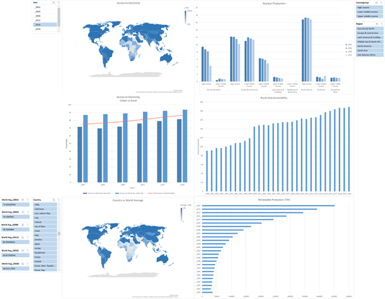

# World-Electricity-Project

# Data Collection and Cleaning for Analysis

This project focuses on the collection and cleaning of data for analysis using web scraping and API integration techniques. 
The objective is to ensure data quality by removing duplicates, handling missing values, and standardizing formats. 
The project showcases expertise in web scraping, data cleaning, and manipulation using pandas and SQL queries. 
By successfully collecting and cleaning the data, this project enables data-driven decision-making.

# Methodology 
1. Identifying data sources online and via APIs.
2. Employing web scraping techniques to collect data.
3. Integrating with APIs to gather external data.
4. Cleaning data by removing duplicates, handling missing values, and standardizing formats using pandas.
5. Performing advanced data processing and transformations with SQL queries.
6. Ensuring data quality and maintaining documentation for transparency and reproducibility.

# Features

Utilized web scraping techniques to collect data from  online sources.
Integrated with APIs to gather data from external platforms.
Implemented data cleaning processes to remove duplicates, handle missing values, and standardize formats.
Utilized pandas library for data manipulation and SQL queries for advanced data processing.

# Results and Impact

The project has achieved the following results and impacts:
Ensured data quality by eliminating duplicates, handling missing values, and standardizing data formats.
Enabled accurate and reliable analysis by providing clean and consistent datasets.
Facilitated data-driven decision-making by delivering high-quality data for analysis.

# Key Insights

1. Global Consumption Trends: Identify trends in global electricity consumption, including seasonal variations and long-term growth patterns.

2. Energy Source Mix: Understand the composition of energy sources used for electricity generation globally, with a focus on renewable energy adoption.

3. Peak Demand Analysis: Determine peak electricity demand periods to aid in infrastructure planning and reliability.

4. Energy Efficiency Opportunities: Identify regions or industries with high energy consumption per capita, highlighting energy efficiency improvement opportunities.

5. Geographical Disparities: Analyze disparities in electricity access and consumption among countries and regions, addressing energy inequality concerns.

6. Economic Implications: Investigate the relationship between electricity consumption and economic development indicators.

7. Renewable Energy Growth: Track the adoption rates of renewable energy sources and factors driving their expansion.

# Challenges
Dealing with an excessive number of columns presented challenges in understanding variable relationships, identifying patterns, and conducting data cleaning tasks in my project. To overcome this, I broke down complex queries into smaller, more manageable parts. Additionally, I streamlined the analysis by selecting only essential columns. Another hurdle was finding common elements across different tables, which was resolved through a combination of SQL and Excel for a comprehensive solution.
